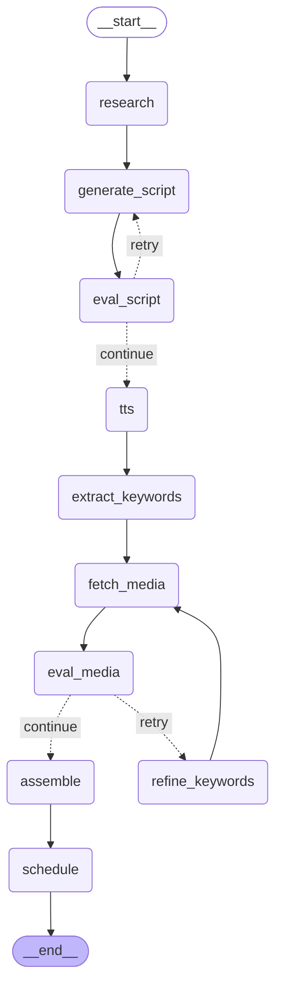

# Shortform Agent

Agentic pipeline koji od **jedne teme** automatski pravi gotov **short-form
video** (YouTube Shorts / TikTok / Reels, 9:16): web research → naslov + skripta
sa self-eval agent petljom → TTS naracija (sa sinhronizovanim titlovima po
recima) → stock vizuali sa self-eval petljom → montaža u MP4 (titlovi se pale
tačno kad se izgovori odgovarajuća reč, CapCut/TikTok stil) → priprema (mock)
scheduled objave.

Ovo **nije** linearni skript. Na dva mesta LLM **sam ocenjuje svoj output** i
odlučuje da ga regeneriše pre nego što ga pusti dalje — to je razlika između
obične automatizacije i pravog agenta.

## Zašto je ovo "agent", a ne skript

Orkestraciju vodi **LangGraph** graf sa dve eksplicitne odluke (conditional
edges), ne skrivene `if`-ove:

Dijagram ispod je generisan direktno iz koda (`graph.get_graph().draw_mermaid()`),
ne crtan rucno — uvek odgovara stvarnom grafu u [`orchestration/graph.py`](orchestration/graph.py).



Da regenerišeš ovaj dijagram posle izmene grafa:

```bash
python -c "from orchestration.graph import build_graph; print(build_graph().get_graph().draw_mermaid())"
```

1. **Checkpoint skripte** — LLM oceni hook u prve 3 sekunde (1–10). Ako je ispod
   praga, regeneriše skriptu sa tom kritikom kao kontekstom (do 3 pokušaja).
2. **Checkpoint vizuala** — LLM oceni da li preuzeti Pexels vizuali odgovaraju
   skripti. Ako ne, generiše bolje keywords i ponovo preuzima (do 3 pokušaja).

Ulaz je **webhook** (`POST /generate`), pa pipeline može da pozove i n8n / Make /
Zapier / obična HTTP integracija.

## Tech stack

| Sloj | Alat | Napomena |
|------|------|----------|
| Orkestracija (agent) | **LangGraph** | state graf + conditional retry edges |
| API / webhook | **FastAPI + uvicorn** | async trigger, status polling |
| LLM | **Groq** (free tier, Llama 3.3 70B) | naslov, skripta, oba self-eval-a — OpenAI-kompatibilan API, velikodušan rate limit |
| Web research | **Tavily** (free tier) | strukturirane reference |
| TTS | **edge-tts** | Microsoft glasovi, bez API ključa |
| Stock media | **Pexels** (free) | slike za slideshow |
| Montaža | **MoviePy** (+ bundlovan ffmpeg) | 9:16, cover-fit, title overlay |
| Scheduling | **mock** | piše `metadata.json`, ne zove upload API-je |

Sve isključivo na **free-tier** servisima. ffmpeg stiže preko `imageio-ffmpeg`
(nije potreban sistemski ffmpeg).

## Struktura

```
pipeline/          # 6 nezavisnih koraka (01_research ... 06_schedule)
  llm_utils.py     # deljeni Groq helperi + Evaluation tip
orchestration/
  graph.py         # LangGraph graf: veže korake + dva retry checkpointa
api.py             # FastAPI webhook (POST /generate, GET /status/{id})
config.py          # putanje, pragovi, glasovi (sve ne-tajno)
tests/             # test po modulu + test grananja grafa (sve mock-ovano)
```

> Moduli su numerisani radi čitljivosti redosleda; imena počinju cifrom pa se
> ne mogu importovati standardno — `pipeline/__init__.py` ih lenjo učitava i
> izlaže kao `from pipeline import research, script, tts, media, assemble, schedule`.

## Pokretanje

**1. Instalacija**

```bash
python -m venv .venv
.venv\Scripts\activate        # Windows (PowerShell: .venv\Scripts\Activate.ps1)
pip install -r requirements.txt
```

**2. Ključevi** — kopiraj `.env.example` u `.env` i popuni:

```
GROQ_API_KEY=...      # https://console.groq.com/keys
TAVILY_API_KEY=...    # https://app.tavily.com
PEXELS_API_KEY=...    # https://www.pexels.com/api/
```

**3. Testovi** (ne troše kvote — svi eksterni pozivi su mock-ovani):

```bash
pytest
```

**4. Server**

```bash
uvicorn api:app --reload
```

**5. Okini pipeline**

```bash
curl -X POST http://127.0.0.1:8000/generate -H "Content-Type: application/json" -d "{\"topic\": \"3 mind-blowing facts about space\"}"
```

Odgovor: `{"run_id": "abc123...", "status": "queued"}`. Prati napredak:

```bash
curl http://127.0.0.1:8000/status/abc123...
```

Kad status pređe u `ready_to_publish`, gotov video i metapodaci su u
`output/<run_id>/` (`audio.mp3`, `media_*.jpg`, `final.mp4`, `metadata.json`).

**6. Vizuelni prikaz**

- `http://127.0.0.1:8000/dashboard/<run_id>` — live prikaz napretka kroz svih
  6 faza (uključujući attempt/score brojače za oba self-eval checkpointa),
  automatski poll-uje `/status` i prikaže gotov video kad je spreman.
- `http://127.0.0.1:8000/docs` — interaktivni Swagger UI (automatski od
  FastAPI-ja), gde možeš direktno da testiraš endpoint-e iz browsera.

## Testiranje

- **Svaki modul se testira izolovano** sa mock-ovanim eksternim pozivima
  (Tavily/Groq/Pexels/edge-tts/ffmpeg) — CI ne troši free-tier kvote.
- **Grananje grafa** je pokriveno posebno: da retry stvarno krene na nisku
  ocenu, da nastavi na visoku, i da stane na max broju pokušaja (za oba
  checkpointa).

## Van scope-a (namerno)

- Ne zove prave TikTok/YouTube/Instagram upload API-je (zahtevaju app review) —
  scheduling je mock priprema `metadata.json`-a.
- Bez plaćenih API tier-ova.
